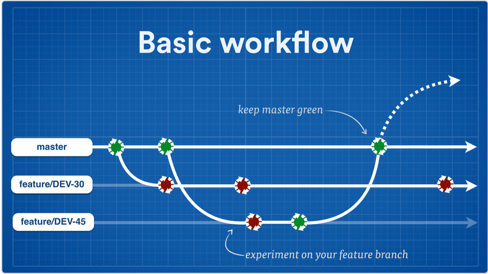
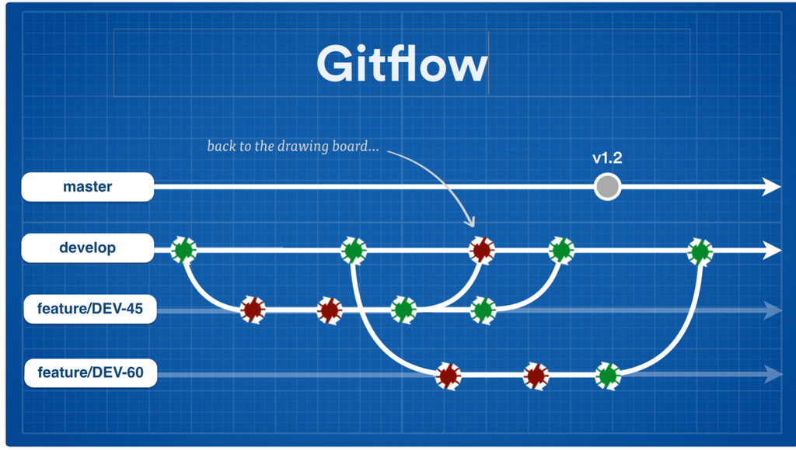

---

 ### Aprender Git
 ### (@aalvz)

 Tinkerware

---

 ### Contenido

 - 

---

 ### Antes de empezar.

 Buscamos tener un mejor flujo al programar.

 Que es lo minimo necesario para poder codificar?

---

  # Git

---

  ### Git

  

---

 ### Qué es?
 !(git)[https://images-cdn.9gag.com/photo/aynmL0X_700b.jpg]

---

 ### Qué es?

 - Es una manera de controlar versiones de archivos.

---

 ### Para?

 

---

 ### Para? Tener super poderes!

 1. Desempeño.

---

 ### Para? Tener super poderes!

 1. Desempeño.
 2. Rastreo.

---

 ### Para? Tener super poderes!

 1. Desempeño. Flujos. 
 2. Rastreo. Cambios e historia
 3. Flexibilidad. Branches, Merges, Experimentacion. 

---

 ### Para? Tener super poderes!

 1. Desempeño. Escalamiento (Hooks, grandes proyectos...)
 2. Rastreo. Cambios e historia
 3. Flexibilidad. Branches, Merges, Experimentacion.
 4. Colaboracion

---

 ### Para? Tener super poderes!

 1. Desempeño. También offline. 
 2. Rastreo. Cambios e historia
 3. Flexibilidad. Branches, Merges, Experimentacion.
 4. Colaboracion
 5. Seguridad y Backups. SHA1

---

  ### Historia

  - Linus Torvalds
  - 2005
  - Gitception
  - Distribuido. Puede ser un server out of the box.
  - "Unpleasent Person"
  - `man git`
  - Junio Hamano

---

 ### Git Areas

 

---

 ### Git Areas

 

---

  ### Exercise!!

---

  ### Git Commits

  

---

  ### Git commands flow

  

---

 ### Git Commands Flow

 
 
---

 ### Git Daily
 

---

 ### Git Branches

 
---

 ### Git Branches

 

---

  ### Otros comandos utiles

  1. `git blame`
  2. git log --graph
  3. git stash
  4. git rebase

---

  ### Resolviendo problemas en Git
  

---

 ### Links utiles

  [Cheat Sheet by GitHub](https://services.github.com/on-demand/downloads/github-git-cheat-sheet.pdf)
  [Cheat Sheet by Git Tower](https://www.git-tower.com/blog/git-cheat-sheet/)
  [Precommit hooks tips](http://codeinthehole.com/tips/tips-for-using-a-git-pre-commit-hook/)
  [Learn git branching](https://learngitbranching.js.org/)
  

---
